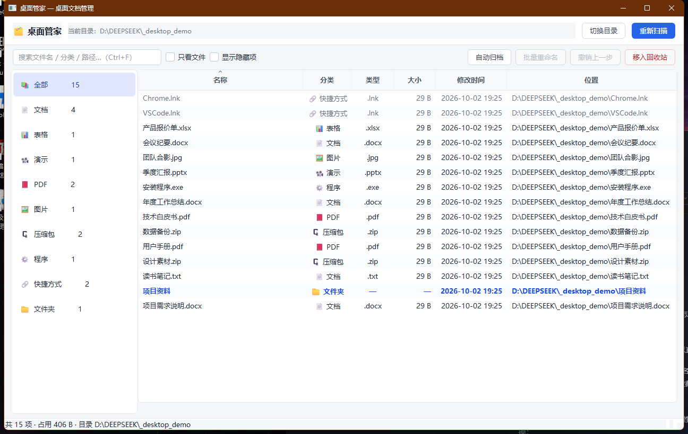
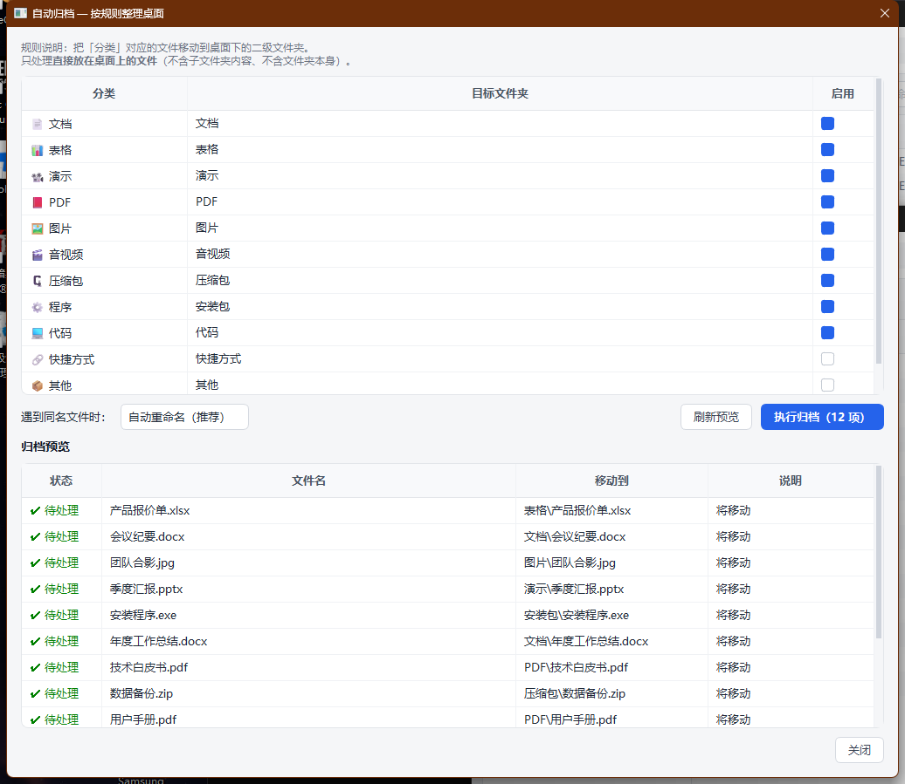

# 桌面管理助手

一个 Windows 桌面管理软件，用 Python + PySide6 写成。
程序界面里显示的名字是 **桌面管家**，项目 / 仓库名叫 **桌面管理助手**。

**当前版本：v0.1.0 — 第一个功能：管理桌面文档**



---

## 一、这个版本能做什么

| 能力 | 说明 |
|---|---|
| **扫描 + 分类展示** | 一键扫出桌面上所有条目，按 文档 / 表格 / 演示 / PDF / 图片 / 音视频 / 压缩包 / 程序 / 代码 / 快捷方式 / 文件夹 / 其他 自动归类 |
| **搜索** | 按文件名、分类、扩展名、完整路径实时筛选（Ctrl+F） |
| **排序** | 点任意列头排序，支持按大小、修改时间排 |
| **自动归档** | 按「分类 → 二级文件夹」规则把桌面文件收进子文件夹，执行前有完整预览 |
| **批量重命名** | 查找替换 / 加前缀 / 加后缀 / 自动编号 / 改大小写，带实时预览 |
| **撤销** | 归档和重命名都可整批还原；撤销归档还会顺手清掉因此变空的文件夹 |
| **回收站删除** | 多选后移入 Windows 回收站，不是硬删除 |

### 安全设计

- **三步走**：规划 → 预览 → 执行。任何会动文件的操作，执行前都先给你一张完整清单。
- **全量台账**：每次落盘操作都记进 `data/undo_journal.json`，随时可整批撤销。
- **越界拒绝**：所有路径必须落在你选定的目录内，越界直接跳过。
- **冲突不覆盖**：同名文件默认自动改名为 `文件名 (1).docx`，不会静默覆盖你的文件。
- **保护子目录**：归档只处理*直接放在桌面上的文件*，不会递归破坏你已有的文件夹结构。
- **回收站兜底**：删除走系统回收站，可还原。

---

## 二、怎么运行

### 从 GitHub 克隆下来之后

```bash
git clone <仓库地址>
cd 桌面管理助手
```

然后双击 **`安装依赖.cmd`**，再双击 **`启动桌面管家.cmd`** 就能用。

> `config.json` 不在仓库里（里面含各人本机的桌面绝对路径），程序首次运行会自动生成一份。
> 想提前了解配置长什么样，看 `config.example.json`。

### 首次使用

双击 **`安装依赖.cmd`**（只需一次，会创建 `.venv` 并装 PySide6，约 250MB）。

### 日常使用

双击 **`启动桌面管家.cmd`**。

出问题时双击 **`调试运行.cmd`**，错误会直接打印在控制台里；
未捕获的异常也会写到 `data/crash.log`。

> 需要电脑上装有 Python 3.10+。没装的话去 https://www.python.org/downloads/ 下载。

---

## 三、界面速查



### 快捷键

| 按键 | 作用 |
|---|---|
| `F5` | 重新扫描 |
| `Ctrl+F` | 聚焦搜索框 |
| `Ctrl+A` | 全选 |
| `Ctrl+Z` | 撤销上一步 |
| `F2` | 批量重命名选中项 |
| `Delete` | 移入回收站 |
| `Enter` | 打开选中项 |
| 右键 | 打开 / 打开所在位置 / 重命名 / 复制路径 / 删除 |

### 自动归档怎么用

1. 点「自动归档」。
2. 上半部分是可编辑的规则表：默认「文档 → `文档\`」「PDF → `PDF\`」……
   - 双击「目标文件夹」可改名，比如把 `安装包` 改成 `软件安装包`。
   - 取消勾选「启用」就不归档该分类（默认已关掉 **快捷方式 / 文件夹 / 其他**，避免动到你的习惯布局）。
3. 选「遇到同名文件时」的处理方式，默认 **自动重命名**。
4. 下半部分实时显示每一条会怎么动。
5. 点「执行归档」，确认后生效。反悔就按 `Ctrl+Z`。

> **注意**：你桌面上的 `文档`、`图片` 文件夹是本来就存在的，归档会往里面放文件。

### 批量重命名怎么用

1. 在列表里选中若干条目（可 Ctrl / Shift 多选）。
2. 点「批量重命名」或按 `F2`。
3. 选一种方式，填参数，下面的预览表实时更新：
   - **查找并替换** — 支持正则、区分大小写；替换框留空 = 删除匹配内容。
   - **添加前缀 / 后缀** — 后缀加在扩展名之前。
   - **自动编号** — `报告01.docx`、`报告02.docx`…；可勾选「保留原文件名」。
   - **修改大小写** — 只改主文件名，扩展名不动。
4. 绿色「改名」的才会被执行；灰色是名称没变，红色是冲突（非法字符、重名等）会被自动跳过。
5. 点「执行重命名」。

---

## 四、配置文件

`config.json`，程序会自动读写：

```json
{
  "desktop_dir": "C:\\Users\\<你>\\Desktop",
  "conflict_policy": "rename",
  "show_hidden": false,
  "recursive": false,
  "rules": [
    { "category": "文档", "target": "文档", "enabled": true },
    { "category": "快捷方式", "target": "快捷方式", "enabled": false }
  ]
}
```

- `desktop_dir` 可以在界面上用「切换目录」改，**也可以指向任意文件夹**，拿来整理下载目录同样好用。
- `conflict_policy`：`rename`（自动改名）/ `skip`（跳过）/ `overwrite`（覆盖）。

---

## 五、项目结构

```
DeskManager/
├── main.py                  程序入口
├── 启动桌面管家.cmd          日常启动
├── 调试运行.cmd              带控制台的启动，排错用
├── 安装依赖.cmd              首次安装 / 修复环境
├── config.example.json      配置范例（真实配置是 config.json，不入库）
├── .gitignore
├── requirements.txt
├── app/
│   ├── categorizer.py       扩展名 → 分类 的映射表
│   ├── scanner.py           目录扫描 → Entry 列表
│   ├── config.py            配置加载/保存、桌面路径探测
│   ├── journal.py           操作台账（撤销用）
│   ├── fileops.py           归档/重命名/撤销/回收站
│   └── ui/
│       ├── main_window.py   主窗口
│       ├── file_model.py    表格模型 + 搜索过滤代理
│       ├── archive_dialog.py 归档对话框
│       ├── rename_dialog.py  重命名对话框
│       └── theme.py         样式表
├── data/                    运行数据（撤销台账、崩溃日志），不入库
└── docs/                    截图
```

---

## 六、开发者：跑测试

两套测试都在临时沙箱目录里跑，**不会碰你的真实桌面**。

```powershell
.\.venv\Scripts\python.exe _selftest.py   # 核心逻辑：扫描/归档/撤销/重命名/越界防护
.\.venv\Scripts\python.exe _guitest.py    # 端到端：真实界面对象走完整操作流程
```

---

## 七、后续功能（待办）

- [ ] 重复文件检测（按内容哈希）
- [ ] 桌面快捷方式专项管理（失效/重复的快捷方式）
- [ ] 大文件 / 老旧文件扫描
- [ ] 自定义归档规则（按扩展名、按关键词）
- [ ] 开机启动项管理、磁盘占用、进程管理……
