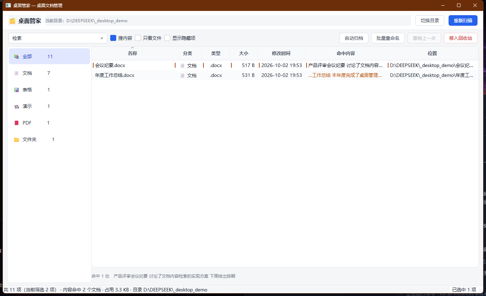
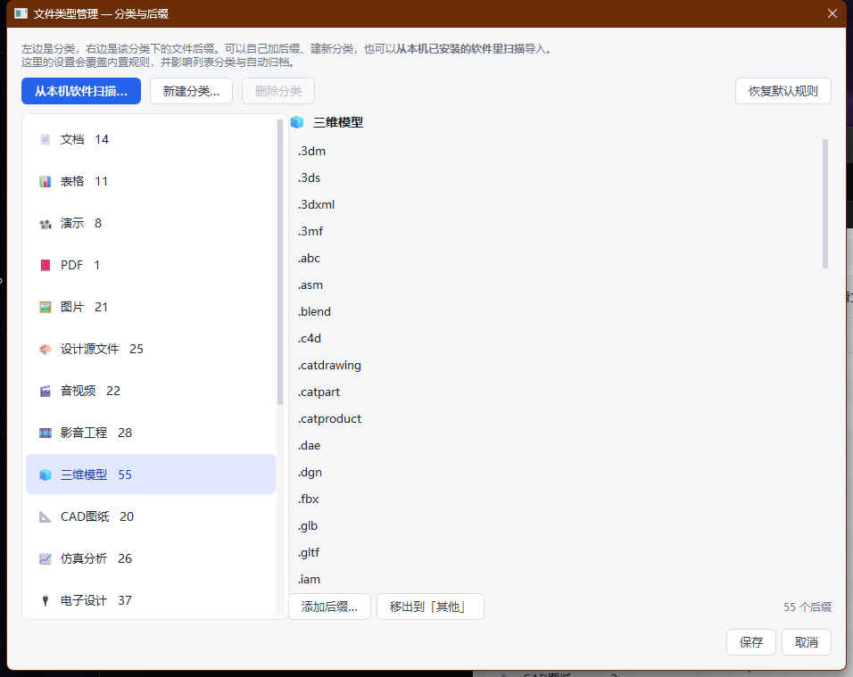
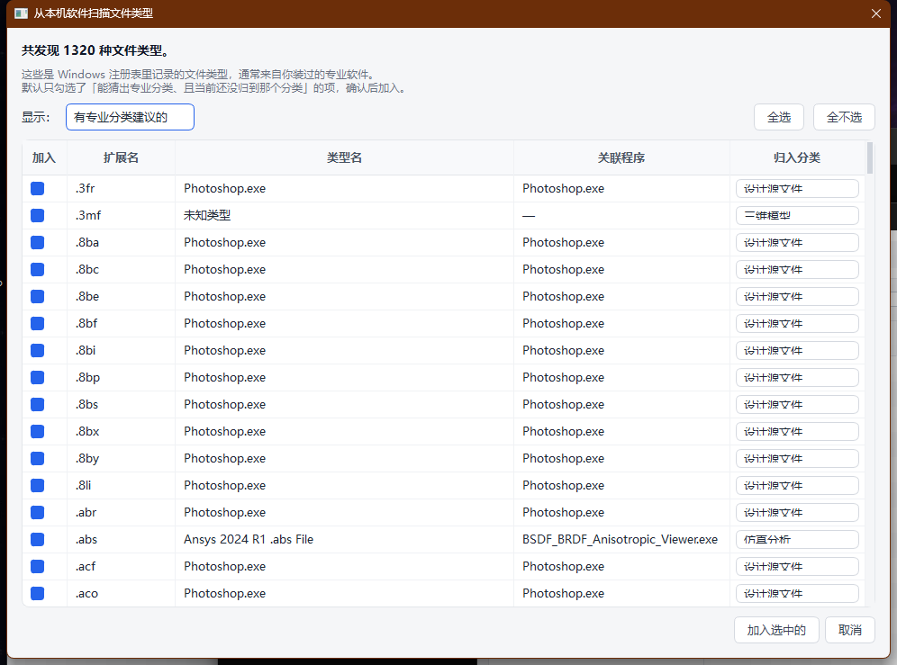

# 桌面管理助手

一个 Windows 桌面管理软件，用 Python + PySide6 写成。
程序界面里显示的名字是 **桌面管家**，项目 / 仓库名叫 **桌面管理助手**。

**当前版本：v0.3.0**
- v0.1.0 — 管理桌面文档：扫描分类、自动归档、批量重命名、撤销
- v0.2.0 — 按文档内容搜索：Word / Excel / PPT / PDF / txt / 代码正文全文检索
- v0.3.0 — 认识专业软件格式：CAD / 三维 / 仿真 / EDA / 设计 / 影音 / 科学计算，
  并能从本机已安装的软件扫描导入，支持自己加后缀和分类


---

## 一、这个版本能做什么

| 能力 | 说明 |
|---|---|
| **扫描 + 分类展示** | 一键扫出桌面上所有条目，自动归类（见下方分类表） |
| **认识专业软件格式** | CAD / 三维模型 / 仿真 / 电路设计 / 设计源文件 / 影音工程 / 科学计算，共 370+ 种后缀 |
| **从本机软件扫描** | 读 Windows 注册表，找出你这台电脑上装过的软件都注册了哪些文件类型，一键导入 |
| **自定义文件类型** | 自己加后缀、建新分类、换图标；改内置分类也不在话下 |
| **搜索文件名** | 按文件名、分类、扩展名、完整路径实时筛选（Ctrl+F） |
| **搜索文档内容** | 不只是文件名——直接搜 Word / Excel / PPT / PDF / txt / 代码**正文里**的字，命中的原句会显示出来 |
| **排序** | 点任意列头排序，支持按大小、修改时间排 |
| **自动归档** | 按「分类 → 二级文件夹」规则把桌面文件收进子文件夹，执行前有完整预览 |
| **批量重命名** | 查找替换 / 加前缀 / 加后缀 / 自动编号 / 改大小写，带实时预览 |
| **撤销** | 归档和重命名都可整批还原；撤销归档还会顺手清掉因此变空的文件夹 |
| **回收站删除** | 多选后移入 Windows 回收站，不是硬删除 |

### 内置分类

| 分类 | 例子 |
|---|---|
| 📄 文档 📊 表格 📽️ 演示 📕 PDF | `docx` `xlsx` `pptx` `pdf` `txt` `md` `csv` |
| 🖼️ 图片 | `jpg` `png` `webp` `heic` `tiff` |
| 🎨 设计源文件 | `psd` `ai` `cdr` `indd` `sketch` `xd` `fig` |
| 🎬 音视频 / 🎞️ 影音工程 | `mp4` `mp3` / `prproj` `aep` `flp` `als` `drp` |
| 🧊 三维模型 | `sldprt` `sldasm` `prt` `catpart` `ipt` `step` `stl` `obj` `fbx` `3dm` |
| 📐 CAD图纸 | `dwg` `dxf` `dwt` `dwf` `dgn` `plt` |
| 📈 仿真分析 | `inp` `cae` `odb` `msh` `wbpj` `cas` `mph` `nas` `bdf` |
| 🔌 电子设计 | `schdoc` `pcbdoc` `brd` `dsn` `gbr` `gtl` `kicad_pcb` |
| 🧪 科学计算 | `mat` `slx` `mlx` `nb` `sav` `dta` `rdata` |
| 🗜️ 压缩包 ⚙️ 程序 💻 代码 🔗 快捷方式 📁 文件夹 📦 其他 | … |

### 安全设计

- **三步走**：规划 → 预览 → 执行。任何会动文件的操作，执行前都先给你一张完整清单。
- **全量台账**：每次落盘操作都记进 `data/undo_journal.json`，随时可整批撤销。
- **越界拒绝**：所有路径必须落在你选定的目录内，越界直接跳过。
- **冲突不覆盖**：同名文件默认在名字后面加数字（`报告.docx` → `报告1.docx`），不会静默覆盖你的文件。
- **保护子目录**：归档只处理*直接放在桌面上的文件*，不会递归破坏你已有的文件夹结构。
- **回收站兜底**：删除走系统回收站，可还原。
- **索引纯本地**：文档正文只提取到本机的 `content_index.db`，不联网、不上传任何内容。

---

## 二、安装到本机（推荐）

打包成独立 exe 之后，**装完不依赖 Python，也不需要管理员权限**。

1. 双击 **`安装到本机.cmd`**
2. 装完后，开始菜单和桌面都会出现「桌面管理助手」

| 项目 | 位置 |
|---|---|
| 程序 | `%LOCALAPPDATA%\Programs\桌面管理助手\` |
| 配置与操作记录 | `%APPDATA%\桌面管理助手\` |
| 快捷方式 | 开始菜单 + 桌面 |
| 卸载 | 设置 → 应用 → 已安装的应用 → 桌面管理助手 |

卸载时会单独问你要不要连配置一起删——**默认保留**，重装后设置还在。

### 从源码自己打包

```powershell
.\build.ps1          # 产物在 dist\桌面管理助手\
```

打包用的是 PyInstaller，`build.ps1` 里已经把 WebEngine / Quick / Multimedia / 3D
等用不到的 Qt 模块全部排除掉，体积能省下 100MB 以上。

---

## 三、从源码运行（开发用）

### 从 GitHub 克隆下来之后

```bash
git clone https://github.com/zlf20060301-max/desktop-manager-assistant.git
cd desktop-manager-assistant
```

然后双击 **`安装依赖.cmd`**，再双击 **`启动桌面管家.cmd`** 就能用。

> `config.json` 不在仓库里（里面含各人本机的桌面绝对路径），程序首次运行会自动生成一份。
> 想提前了解配置长什么样，看 `config.example.json`。

### 首次使用

双击 **`安装依赖.cmd`**（只需一次，会创建 `.venv` 并装 PySide6，约 250MB）。

### 日常使用

双击 **`启动桌面管家.cmd`**。

出问题时双击 **`调试运行.cmd`**，错误会直接打印在控制台里；
未捕获的异常也会写到 `data/crash.log`。

> 需要电脑上装有 Python 3.10+。没装的话去 https://www.python.org/downloads/ 下载。

> **源码运行**时数据放在项目目录里（`config.json`、`data\`），**安装版**放在 `%APPDATA%\桌面管理助手\`。
> 两者互不干扰，可以同时存在。

---

## 四、界面速查


### 搜索框旁边的三个开关

| 开关 | 作用 |
|---|---|
| **搜内容** | 搜索范围从文件名扩展到文档正文（见第五节） |
| **只看文件** | 把文件夹隐藏掉，只看文件 |
| **显示隐藏项** | 连隐藏文件一起列出 |
| **含子文件夹** | 连子文件夹里的文件一起列出，**广度优先**，最多 20000 项 |

> **关于「含子文件夹」**：默认关闭。你的桌面顶层只有几十项，但整棵目录树可能有
> **几万项**（实测这台电脑是 82698 项、5.6 GB 的专业文件）。所以打开后：
> - 会**浅层优先**地取前 20000 项——离桌面近的文件一定先出现，被截掉的是最深的那些；
> - 到达上限时状态栏会明确提示「结果被截断」；
> - **归档操作仍然只处理直接放在桌面上的文件**，不会动子目录里的东西。
>
> 如果你的专业文件都在某个子文件夹里（比如 `图纸模型\`），
> 更好的做法是用 **「切换目录」** 直接指过去，这样不受上限影响。

### 快捷键

| 按键 | 作用 |
|---|---|
| `F5` | 重新扫描 |
| `Ctrl+F` | 聚焦搜索框 |
| `Ctrl+A` | 全选 |
| `Ctrl+Z` | 撤销上一步 |
| `F2` | 批量重命名选中项 |
| `Delete` | 移入回收站 |
| `Enter` | 打开选中项 |
| 右键 | 打开 / 打开所在位置 / 重命名 / 复制路径 / 删除 |

### 自动归档怎么用

1. 点「自动归档」。
2. 上半部分是可编辑的规则表：默认「文档 → `文档\`」「PDF → `PDF\`」……
   - 双击「目标文件夹」可改名，比如把 `安装包` 改成 `软件安装包`。
   - 取消勾选「启用」就不归档该分类（默认已关掉 **快捷方式 / 文件夹 / 其他**，避免动到你的习惯布局）。
3. 选「遇到同名文件时」的处理方式，默认 **自动重命名**。
4. 下半部分实时显示每一条会怎么动。
5. 点「执行归档」，确认后生效。反悔就按 `Ctrl+Z`。

> **注意**：你桌面上的 `文档`、`图片` 文件夹是本来就存在的，归档会往里面放文件。

### 批量重命名怎么用

1. 在列表里选中若干条目（可 Ctrl / Shift 多选）。
2. 点「批量重命名」或按 `F2`。
3. 选一种方式，填参数，下面的预览表实时更新：
   - **查找并替换** — 支持正则、区分大小写；替换框留空 = 删除匹配内容。
   - **添加前缀 / 后缀** — 后缀加在扩展名之前。
   - **自动编号** — `报告01.docx`、`报告02.docx`…；可勾选「保留原文件名」。
   - **修改大小写** — 只改主文件名，扩展名不动。
4. 状态列的含义：
   - **✔ 改名** — 会被执行
   - **✔ 加数字** — 新名字撞上了已有文件，自动在名字后面加数字（`报告.docx` → `报告1.docx`）
   - **— 不变** — 名称没变化，不动它
   - **✖ 跳过** — 名字非法（空名，或含 `\ / : * ? " < > |`），没法用加数字掩盖
5. 点「执行重命名」。

> **重名规则**：无论是归档时目标文件夹里已有同名文件，还是批量重命名时撞名，
> 都统一在**名字后面直接接数字**——`报告.docx` 已存在时新文件叫 `报告1.docx`，
> 再撞就叫 `报告2.docx`。原始文件永远不会被覆盖。
>
> 扩展名保持不变：`备份.tar.gz` → `备份.tar1.gz`。

---

## 五、搜索文档内容



勾上搜索框旁边的 **「搜内容」**，搜索范围就从文件名扩展到**文档正文**。

### 怎么用

1. 勾选 **「搜内容」**。第一次会弹出一个后台索引过程（状态栏显示进度），
   索引建好之后是增量的——只有改动过的文件才会重新读。
2. 在搜索框里输入任意词，回车或稍等一下。
3. 列表会多出一列 **「命中内容」**，显示命中的原句；点某一行，
   底部信息条给出**完整的上下文**和命中次数。

搜索是**子串匹配**：输入「有限元」就能找到正文里写着「机械结构有限元分析预算」的表格。
输入多个词用空格分开（如 `预算 有限元`），表示**这几个词都要出现**。
英文不分大小写。

### 支持哪些格式

| 类型 | 扩展名 | 说明 |
|---|---|---|
| Office 新格式 | `.docx` `.xlsx` `.pptx` `.docm` `.xlsm` `.pptm` | 标准库直接解 zip+XML，不需要装 Office |
| OpenDocument | `.odt` `.ods` `.odp` | 同上 |
| PDF | `.pdf` | 用 pypdf 提取；**扫描件（图片版 PDF）提不出文字** |
| 纯文本 | `.txt` `.md` `.csv` `.log` `.json` `.xml` `.yaml` `.ini` 等 40+ 种 | 自动识别 UTF-8 / GBK / Big5 编码 |
| 代码 | `.py` `.js` `.ts` `.java` `.c` `.cpp` `.go` `.rs` 等 | 同上 |
| RTF | `.rtf` | 支持 `\uNNNN` 和 `\'xx`(GBK) 两种转义 |

**不支持**：老版二进制 Office（`.doc` `.xls` `.ppt` `.wps`）——这类格式没有公开的纯 Python 解析方案。
它们仍会出现在列表里、仍能按**文件名**搜到，只是搜不到正文，点中时会明确告诉你原因。

### 说明

- 索引只对**当前目录**（默认桌面）里的文档建立，不会去翻子目录里的内容。
- 单个文件超过 8 MB、PDF 超过 300 页会被跳过，避免卡住。
- 想强制重建：右键列表 → **「重建内容索引」**。
- 索引库位置：安装版在 `%APPDATA%\桌面管理助手\data\content_index.db`，
  源码版在 `data\content_index.db`。删掉它重启即可重建。

---

## 六、认识专业软件的文件格式



点顶部 **「文件类型」** 打开管理界面：左边是分类，右边是该分类下的后缀。

### 从本机软件扫描（推荐先做这一步）

点 **「从本机软件扫描…」**，程序会去读 Windows 注册表——每个软件安装时都会声明
"我能打开这些文件"，这些记录就在注册表里。所以不用猜你装了什么，直接问系统。



扫描结果按 **扩展名 / 类型名 / 关联程序 / 建议分类** 列出来：

- 默认只显示**能猜出专业分类、且当前还没归到那个分类**的项。比如你机器上装了
  AnnaSys，`.inp` `.odb` `.msh` `.wbpj` 这些会被自动建议归到「仿真分析」。
- 每个分类都是下拉框，可以当场改。
- 表头「加入」一列控制要不要导入，支持「全选 / 全不选」。
- 猜分类的逻辑：先按后缀精确匹配内置表，匹配不到就看类型名和程序名里的关键词
  （"Ansys 2024 R1 .inp File" 里有 ansys → 仿真分析）。

### 自己加后缀和分类

- **添加后缀…** —— 在某个分类下加后缀，可以一次填多个（`.abc .def` 或 `abc, def` 都行）。
  如果这个后缀原本属于别的分类，会被移过来。
- **新建分类…** —— 起个名字、挑个 emoji 图标，它会立刻出现在左侧栏和归档规则里。
- **移出到「其他」** —— 把后缀从当前分类里摘出去。
- **恢复默认规则** —— 丢掉所有自定义，回到内置的 370 多条映射。

> 改完点「保存」才生效。程序只把**和内置表不一样的部分**写进配置文件——
> 改 2 个后缀，`config.json` 里就只有 2 行，不会把 370 多条全抄一遍。

### 一个实际的例子

这台电脑上装了 SOLIDWORKS 2026 和 ANSYS 2024 R1，桌面截图里的效果：

| 文件 | 分类 |
|---|---|
| `法兰盘.SLDPRT`、`减速箱装配.sldasm`、`箱体工程图.slddrw`、`整机.step`、`支架网格.stl` | 🧊 三维模型 |
| `总装图.dwg`、`零件图.dxf` | 📐 CAD图纸 |
| `静力分析.inp`、`模态分析.wbpj` | 📈 仿真分析 |
| `主控板.pcbdoc`、`原理图.schdoc` | 🔌 电子设计 |
| `宣传海报.psd`、`LOGO.ai`、`产品画册.indd` | 🎨 设计源文件 |
| `宣传片.prproj`、`片头特效.aep` | 🎞️ 影音工程 |
| `试验数据.mat`、`控制模型.slx` | 🧪 科学计算 |

---

## 七、配置文件

`config.json`，程序会自动读写：

```json
{
  "desktop_dir": "C:\\Users\\<你>\\Desktop",
  "conflict_policy": "rename",
  "show_hidden": false,
  "recursive": false,
  "content_search": true,
  "custom_categories": [
    { "name": "我的图纸", "icon": "📐" }
  ],
  "ext_overrides": {
    ".dwg": "我的图纸",
    ".zzq": "三维模型"
  },
  "rules": [
    { "category": "文档", "target": "文档", "enabled": true },
    { "category": "快捷方式", "target": "快捷方式", "enabled": false }
  ]
}
```

- `desktop_dir` 可以在界面上用「切换目录」改，**也可以指向任意文件夹**，拿来整理下载目录同样好用。
- `conflict_policy`：`rename`（重名就加数字）/ `skip`（跳过）/ `overwrite`（覆盖）。
- `content_search`：是否默认开启「搜内容」。
- `custom_categories` / `ext_overrides`：来自「文件类型管理」。
  **只记录和内置表不同的部分**，所以改几个后缀这里就只有几行。
  想回到出厂设置，把这两项删掉即可（或在界面上点「恢复默认规则」）。

---

## 八、项目结构

```
DeskManager/
├── main.py                  程序入口
├── 安装到本机.cmd            把软件装到这台电脑（使用打包好的 exe）
├── build.ps1                用 PyInstaller 打包成独立 exe
├── 启动桌面管家.cmd          源码方式启动
├── 调试运行.cmd              带控制台的启动，排错用
├── 安装依赖.cmd              开发环境：创建 .venv 并装 PySide6
├── config.example.json      配置范例（真实配置是 config.json，不入库）
├── .gitignore / .gitattributes
├── requirements.txt
├── app/
│   ├── categorizer.py       分类表（内置 370+ 后缀）+ CategoryMap 用户覆盖 + 猜分类
│   ├── icons.py             分类图标（emoji，不含资源文件）
│   ├── winfiletypes.py      从 Windows 注册表发现本机已安装软件注册的文件类型
│   ├── scanner.py           目录扫描 → Entry 列表
│   ├── config.py            配置加载/保存、桌面路径探测、冻结环境判定
│   ├── extract.py           从 docx / xlsx / pptx / pdf / rtf / txt 里抠出正文
│   ├── content_index.py     SQLite 内容索引：增量缓存 + 子串搜索 + 命中片段
│   ├── journal.py           操作台账（撤销用）
│   ├── fileops.py           归档/重命名/撤销/回收站
│   └── ui/
│       ├── main_window.py   主窗口
│       ├── file_model.py    表格模型 + 搜索过滤代理
│       ├── filetype_dialog.py 文件类型管理 + 本机软件扫描
│       ├── indexer.py       内容索引的后台线程
│       ├── archive_dialog.py 归档对话框
│       ├── rename_dialog.py  重命名对话框
│       └── theme.py         样式表
├── installer/
│   ├── install.ps1          安装：复制文件 + 快捷方式 + 注册卸载项
│   ├── uninstall.ps1        卸载：清理 + 可选删除用户数据 + 自删除
│   └── 卸载.cmd              安装目录里的卸载入口
├── tools/make_icon.py       生成应用图标
├── assets/                  icon.ico / icon.png
├── _selftest.py             核心逻辑测试（134 项断言）
├── _guitest.py              端到端界面测试（69 项断言）
├── _fixtures.py             测试用的文档样本生成器
├── build/ dist/             打包产物，不入库
├── data/                    运行数据（撤销台账、内容索引、崩溃日志），不入库
└── docs/                    截图
```

> 所有 `.ps1` 都以 **UTF-8 BOM** 保存。Windows PowerShell 5.1 遇到无 BOM 的
> UTF-8 文件会按 GBK 解析，中文注释会被打乱导致脚本报语法错误——改这些文件时请注意别把 BOM 弄丢。

---

## 九、开发者：跑测试

两套测试都在临时沙箱目录里跑，**不会碰你的真实桌面、也不会动你的真实配置和索引库**。

```powershell
.\.venv\Scripts\python.exe _selftest.py   # 134 项：扫描/归档/重名/内容/专业分类/自定义后缀/越界防护
.\.venv\Scripts\python.exe _guitest.py    # 69 项：真实界面对象走完整操作流程
```

文档样本由 `_fixtures.py` 现场生成（docx / xlsx / pptx / pdf / rtf / GBK 文本 /
故意损坏的文件），所以测试完全离线、可重复，不需要任何外部素材。

> 内容索引的路径是**可注入**的，测试传的是临时目录。这一点很重要——
> 否则跑一次测试就会把临时文件塞进你真实的内容索引里。

---

## 十、后续功能（待办）

- [x] ~~搜索文档内容~~（v0.2.0 已完成）
- [x] ~~专业软件格式识别 + 自定义后缀分类~~（v0.3.0 已完成）
- [ ] 搜索结果里直接预览文档片段（目前只显示一行命中）
- [ ] 重复文件检测（按内容哈希）
- [ ] 桌面快捷方式专项管理（失效/重复的快捷方式）
- [ ] 大文件 / 老旧文件扫描
- [ ] 老版 `.doc` / `.xls` 正文提取（需要额外方案）
- [ ] 按「关联程序」批量分类（现在只按后缀）
- [ ] 开机启动项管理、磁盘占用、进程管理……
